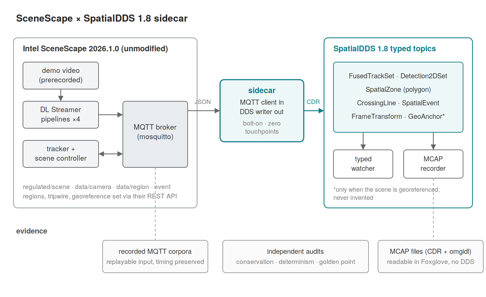
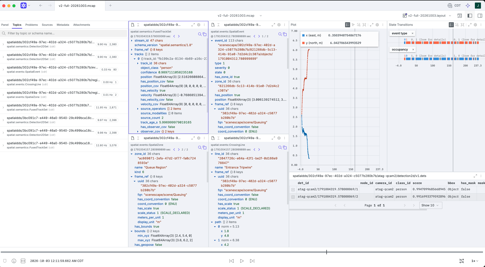

# spatialdds-scenescape

Publishes [Intel SceneScape][ssweb] scene analytics as typed
[SpatialDDS 1.8][sdweb] samples. It runs beside SceneScape as an ordinary MQTT
client. It changes nothing in SceneScape and never publishes back to it. Stop
it and their stack carries on.



Here is what comes out, in Foxglove, from the sample recording in this
repository. Every value on screen was decoded by Foxglove from the schemas the
file carries. Nothing from here is running.



## Try it in 30 seconds

1. Open `samples/queuing-retail-sample.mcap` in Foxglove.
2. Import `samples/queuing-retail-sample.layout.json` from the layout menu.
3. Press play.

15,676 typed samples from a running deployment: two scenes, four cameras, two
zones, one crossing line, 80 zone events, 92 world model entities. CDR with omgidl schemas, so any
schema aware reader decodes it without code from this repository.

## How it fits

The sidecar holds one MQTT subscription and one read-only REST call. The REST
call cannot be avoided: zone geometry, camera to scene membership and the
georeference are not discoverable from the bus. A zone nobody walks into
publishes nothing at all, so listening can never tell you it exists.

| SceneScape | SpatialDDS 1.8 |
|---|---|
| `regulated/scene` | `FusedTrackSet` |
| `data/camera/<id>` | `Detection2DSet` |
| `event/region/...`, `event/tripwire/...` | `SpatialEvent` |
| scene regions | `SpatialZone` |
| scene tripwires | `CrossingLine` |
| scene georeference | `GeoAnchor`, `FrameTransform` |

Zones, lines, anchors and transforms are latched: published once, RELIABLE and
TRANSIENT_LOCAL, so a late reader still gets the layout.

## The world model lane

The sidecar also publishes SceneScape's state as `spatial.owm/0.1` entities, a
provisional module that is independently versioned and exempt from the 1.x
additive guarantee. The lane is additive: with it switched off the other lanes
are byte-identical, which a gate checks rather than a comment claims.

| SceneScape | `owm::Entity` |
|---|---|
| a fused track appears | basis `OBSERVED`, state `ACTIVE`, pose from the first sighting |
| a fused track leaves | state `RETIRED` with the reason, then dispose per §2.14 |
| a configured region | basis `DECLARED`, extent, and a `footprint_zone_id` property naming its `SpatialZone` |

**It is the slow tier.** Entities are published on lifecycle change, not per
frame. Over the sample recording that is 92 entity samples against 15,584 on
the other lanes, one in 169. Per-frame pose stays on `FusedTrackSet`, which
already carries it with covariance and track provenance. `ModelPose` is
therefore not published at all: two writers describing one physical thing is
what Appendix M.2 forbids.

Tripwires get no entity. A `CrossingLine` is not an area, 0.1 has no line
shape, and a box drawn around a line asserts an area nobody drew.

The module is provisional and this adapter is its second independent
implementation, so the point of the lane is as much what it could not express
as what it could. `FINDINGS.md` carries the coverage census, every surface
marked exercised or not with the reason, and seven findings against the module
itself. The headline one: an area entity has no field that can reference its
own footprint, so the join to `SpatialZone` is carried as a declared property
pending a module decision.

Because the module's layout may change incompatibly between revisions, its IDL
is vendored and pinned by content digest in `idl/PROVENANCE`, and the recording
embeds it. `v0` in the topic name is the profile MAJOR version, not a
compatibility promise.

## Status

Built against [Intel SceneScape][ss] `2026.1.0`, commit
[`91afcb747dc9b9985ccaa036c760f18a71ef19a2`][sspin], and [SpatialDDS 1.8][sd]
at spec commit
[`424a8b3d8e0c3fab24c32de9fa146f8b9180a8f2`][sdpin]. Both pins are also
recorded in `idl/PROVENANCE` and `spatialdds18/_provenance.py`.

Validated by replay. Two recordings totalling 52,861 real MQTT messages were
translated and reconciled against their inputs. The sample here is the output
of the larger one: 30,701 messages in, 15,676 typed samples out. The live path
has been run against a real broker, in runs lasting tens of seconds.

Not long soaked. Nothing here tells you about memory over hours, broker
reconnection, or a SceneScape restart underneath a running sidecar.

1.8 is a draft. This adapter has already caused two amendments to it. If it
changes again the bindings need regenerating, and the wire may move with them.

One oddity worth knowing: `Vec2` is APPENDABLE rather than FINAL, so its
elements are delimited. FINAL is correct under XCDR2 and four octets smaller
per vertex, but a widely used omgidl deserializer wants a delimiter on every
nested struct element whatever the schema says, and rejects the FINAL form.
The reasoning is in the IDL beside the type.

## Run it against your own SceneScape

Get their demo working first and confirm it produces detections.

```sh
# the scene configuration the translator needs
python3 tools/fetch_scene_config.py --out samples/scene-config-live.json \
    --resolution <scene-uid> <map-width-px> <map-height-px>

# subscribe, translate, publish DDS, write MCAP
sudo tools/bridge_live.sh samples/scene-config-live.json out.mcap

# in another terminal, read the typed output back off DDS
PYTHONPATH=. python3 -m sidecar.watch --scene <scene-uid> --cameras <cam1>,<cam2>
```

`SCENESCAPE_ROOT` points at your SceneScape checkout, default
`/opt/scenescape`. The password file argument names SceneScape's own superuser
credential file, which these tools read and never write.

Optional, both through their documented REST API:

```sh
python3 tools/configure_scene.py --scene <scene-uid>
python3 tools/enable_georeference.py --scene <scene-uid> \
    --resolution <w> <h> --lat <lat> --lon <lon> --yaw <deg>
```

Georeferencing makes the sidecar publish `GeoAnchor` and `FrameTransform`, and
moves tracks from a local frame onto the earth.

Needs Python 3.10 or later, `cyclonedds` with its Python bindings, and `mcap`.
The render gate also wants Node and Playwright, and skips cleanly without them.

## Evidence

These produced the numbers above. One runner executes all of them and reports
what happened to each, including the ones it could not run:

```
$ python3 gates/run_all.py --no-corpus

  PASS     bindings_roundtrip  every generated struct imports and round-trips CDR
  PASS     translation_check   the eight translations hold, field by field, on real messages
  PASS     golden_vector       georeference against the producer's published worked example
  PASS     golden_point        georeference against the producer's live per-object output
  PASS     schema_check        embedded schemas are self-contained and every channel decodes
  PASS     layout_check        every Foxglove layout path resolves against the recording
  PASS     render_check        a headless browser renders a value for every panel path
  SKIPPED  stamp_fidelity      published timestamps are exactly the producer's timestamps
                               needs a recorded corpus: restore corpora-20261003.tgz, see CORPORA.md
  SKIPPED  conservation_audit  every input topic accounted for, every 1:1 mapping exact
                               needs a recorded corpus: restore corpora-20261003.tgz, see CORPORA.md
  SKIPPED  determinism         two replays of one input give byte-identical content
                               needs a recorded corpus: restore corpora-20261003.tgz, see CORPORA.md
  SKIPPED  route_regress       four past defects stay fixed
                               needs a recorded corpus: restore corpora-20261003.tgz, see CORPORA.md
  PASS     owm_golden_vector   one entity's whole lifecycle, field by field against the raw messages
  SKIPPED  owm_lifecycle       one entity per track lifecycle, and the lane is the slow tier
                               needs a recorded corpus: restore corpora-20261003.tgz, see CORPORA.md
  SKIPPED  owm_route_equiv     replay and the live bridge publish identical owm samples
                               needs a recorded corpus: restore corpora-20261003.tgz, see CORPORA.md
  PASS     readme_manifest     the README quotes this manifest exactly

15 gates: 9 passed, 0 failed, 6 skipped
```

Nine run on the shipped sample and its bundled fixture, with no deployment at
all. The other six need the recording itself and not just the shipped output,
because they compare translated output against the input it came from. Restore
the corpora beside this checkout and the runner finds them, with no flag and no
path to remember:

```
$ python3 gates/run_all.py

15 gates: 15 passed, 0 failed, 0 skipped
```

[`CORPORA.md`](CORPORA.md) says which objects to restore and where, and pins
their digests, so a gate result can be traced to the bytes it was computed
from. `tools/verify_corpora.py` checks a restored copy against those digests.
`--corpus <dir>` points at a recording somewhere else, and `--no-corpus`
ignores the one beside the checkout, which is the manifest quoted above and
the one a clean clone prints on its own.

One row in that block is environment dependent: `render_check` drives a
headless browser, so it reports SKIPPED on a machine without Node and
Playwright, and `readme_manifest` then correctly reports that the quoted block
is not what your machine prints. The block above is from a machine with both
installed. Nothing else in it depends on an optional dependency.

That manifest is the verification claim rather than a sentence written beside
one. A gate that cannot run says so by name, instead of being quietly missing
from a count, which is how two of these stayed broken for a fortnight. The
last row checks that this block is what the runner actually prints, so the
quote cannot drift from the thing it quotes.

Individually:

| gate | what it shows |
|---|---|
| `bindings_roundtrip` | 103 generated structs import and round trip through CDR |
| `translation_check` | all eight translations, assertion by assertion, on real SceneScape messages: tripwires set `has_crossing`, keypoints land in the §2.15 metadata bag, `thing_type` falls back to the topic and is never invented, an ungated scale says `SCALE_UNKNOWN`. Ships a 25 message fixture so it runs on a clean clone, and takes a full recording when there is one |
| `golden_vector` | the georeference matches SceneScape's own worked example to 0.0018 m |
| `golden_point` | and their live per object latitude and longitude to 0.009 mm |
| `schema_check` | every embedded schema is self contained, named correctly, compiles, and its first message decodes |
| `layout_check` | every path in the Foxglove layout resolves against the file |
| `render_check` | a headless browser decodes the file with Foxglove's own libraries and renders all nine panel paths |

The other six need a recording rather than an MCAP, because they compare
output against the input it came from. `gates/run_all.py` runs them for you;
to run one on its own, make a recording with `tools/record_corpus.sh` or
restore one per [`CORPORA.md`](CORPORA.md), then:

```sh
PYTHONPATH=. python3 tools/replay_to_mcap.py <corpus-dir> \
    --scene-config samples/scene-config.json --label replay
PYTHONPATH=. python3 gates/conservation_audit.py <corpus-dir> <corpus-dir>/replay.mcap
PYTHONPATH=. python3 gates/determinism.py <corpus-dir> \
    --scene-config samples/scene-config.json
PYTHONPATH=. python3 gates/route_regress.py <corpus-dir> \
    --scene-config samples/scene-config.json
PYTHONPATH=. python3 gates/stamp_fidelity.py <corpus-dir> <corpus-dir>/replay.mcap
PYTHONPATH=. python3 gates/owm_lifecycle.py <corpus-dir> <corpus-dir>/replay.mcap \
    --scene-config samples/scene-config.json
PYTHONPATH=. python3 gates/owm_route_equiv.py <corpus-dir> \
    --scene-config samples/scene-config.json
```

| gate | what it shows |
|---|---|
| `conservation_audit` | every input topic accounted for, every one to one mapping exact. Imports neither the translator nor the bindings, so the count is independent |
| `determinism` | two replays of the same input give byte identical content |
| `route_regress` | four past defects stay fixed: camera to scene attribution, dwell read from the event rather than joined, per scene sequence numbers, and the exit event payload shape |
| `stamp_fidelity` | every published `sec`/`nanosec` pair is exactly a timestamp the producer sent, compared against its own ISO strings |
| `owm_lifecycle` | one entity per track lifecycle, each create matched to a retire, and the lane published on lifecycle change rather than per frame |
| `owm_route_equiv` | replay and the live bridge publish byte identical entity samples, the stamp on latched definitions excepted by design |

`render_check` drives Foxglove's `@mcap/core`, `@foxglove/omgidl-parser` and
`@foxglove/omgidl-serialization` in headless Chromium. It is not the Foxglove
application, so it cannot tell you that every panel setting is one the app
honours. It does tell you the schemas parse and the messages decode, which is
where the failures were.

## Layout

```
sidecar/        router, mapping, bridge, MCAP writer, watcher, owm
spatialdds18/   generated bindings, with the spec commit recorded
idl/v1.8/       the IDL they came from, and its PROVENANCE
tools/          recording, replay, scene config, layout generation
gates/          everything above
samples/        the recording, its layout, screenshots, configs, the fixture
FINDINGS.md     what this adapter learned, our defects included
CORPORA.md      where the recordings live and how to prove they are right
```

`python3 tools/generate_bindings.py` regenerates the bindings from `idl/`. It
reproduces `spatialdds18/` byte for byte.

## Credits

[Intel SceneScape][ss] is the source system. Their release, their demo data
and their functional tests were used throughout. The worked georeference
example in their test suite found a real bug in this adapter, which is the
best argument for shipping test vectors we know of.

[SpatialDDS][sd] 1.8's observer pose covariance work, including the `CovScope`
composition guard, came out of review with the SceneScape team. Their fused
tracks carry observer uncertainty that had nowhere to go in 1.7.

## Licence

MIT, see `LICENSE`. The IDL under `idl/` comes from the [SpatialDDS
specification][sd] and keeps its own SPDX headers.

[ss]: https://github.com/open-edge-platform/scenescape
[sspin]: https://github.com/open-edge-platform/scenescape/commit/91afcb747dc9b9985ccaa036c760f18a71ef19a2
[sd]: https://github.com/OpenArCloud/SpatialDDS-spec
[sdpin]: https://github.com/OpenArCloud/SpatialDDS-spec/commit/424a8b3d8e0c3fab24c32de9fa146f8b9180a8f2
[ssweb]: https://www.intel.com/content/www/us/en/developer/tools/scenescape/overview.html
[sdweb]: https://spatialdds.org
